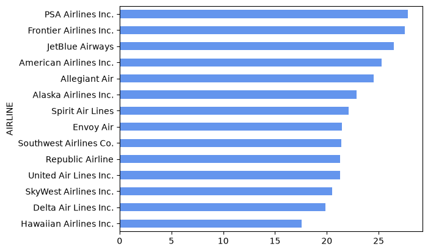
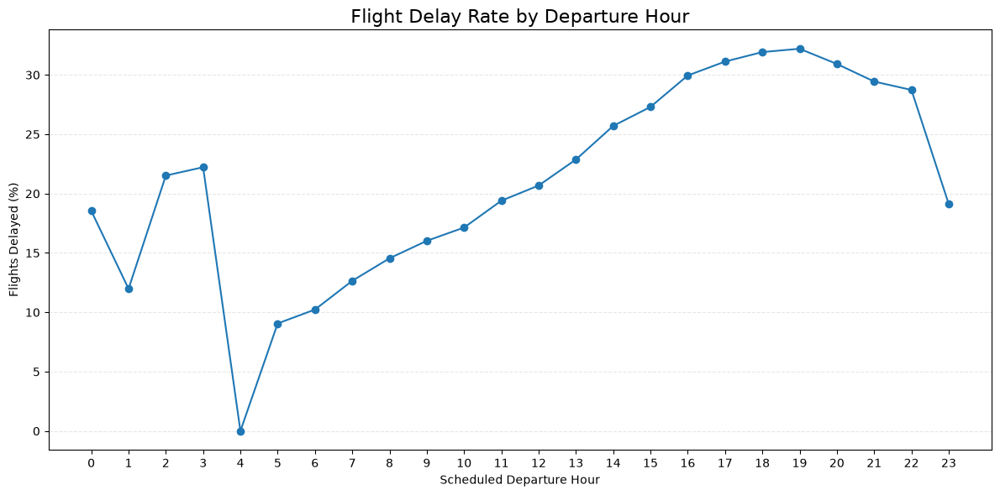
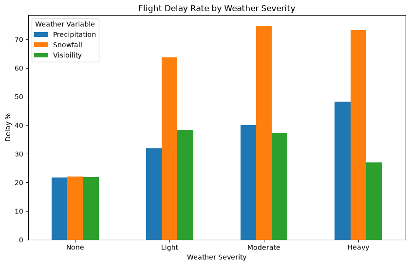
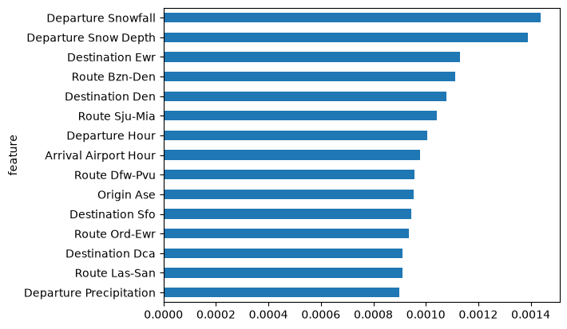

# Flight Delay Prediction

[](https://flight-delay-predictor-app.streamlit.app)

## Executive Summary

*	Developed an app for passengers to input their flight details and see the forecasted chance of the flight arriving more than 15 minutes late

*	Uses a machine learning model trained on historical US flight data enriched with historical weather forecast data 

*	When a user clicks predict the app will fetch the forecasted weather for the departure and arrival airports at the time of departure/arrival and incorporate the information into the prediction

* The user can see the prediction, delay or not, the prediction percentage and the key contributing factors for the individual prediction

* Passengers can use this app to assist with travel planning, particularly for connecting flights where on-time arrival can be essential


## App Screenshot


## Repo Structure

```text
.
├── README.md
├── app.py
├── assets # used for README
│   ├── calibration-curve.png
│   └── example-image.png
├── data
│   ├── processed # contains output from src/data_pipeline.py and necessary data for app.py
│   └── raw # raw flight and weather data
├── dockerfile
├── models 
│   └── xgboost_v1.joblib # main model used in app.py
├── notebooks # used for EDA and model training
│   ├── Enhance Airport Lookup table.ipynb
│   ├── Full Pipeline Test.ipynb
│   ├── Weather Experiments.ipynb
│   ├── Weather Models.ipynb
│   ├── full_EDA_preweather.ipynb
│   ├── initial_EDA.ipynb
│   └── model_exploration.ipynb
├── pyproject.toml
├── src
│   ├── data_pipeline.py
│   └── model_training.py
└── uv.lock
```

* Use the python scripts in `src` to replicate processed training data and final model
* Most raw data is not included due to file sizes

## Data Details

*	2025 data from the [US Bureau of Transportation Statistics]( https://transtats.bts.gov/DL_SelectFields.aspx?gnoyr_VQ=FGJ&QO_fu146_anzr=b0-gvzr)

*	Each row represents one flight containing departure name, arrival name, distance, date and a binary indicator showing if the flight arrived more than 15 minutes late on arrival

*	Weather forecast data from [Open-Meteo]( https://open-meteo.com). Merged into flight data in two ways.

    1.	Departure weather merged on the latitude and longitude of the departure airport at the hour of departure

    2.	Arrival weather merged on the latitude and longitude of the arrival airport at the hour of arrival

*	Weather data included temperature, precipitation, visibility, wind and surface pressure

* Full development process is available in `/notebooks` in the annotated notebooks

## EDA 

* Before OHE encoding the full dataset has 360,000 rows and 32 columns. 20% of the data was kept aside for testing on the final model, the other 80% was used on training and cross validation to tune hyperparameters.



* 22.2% of all flights in the data were delayed, with PSA Airlines the most delayed at 27.84% and Hawaiian Airlines the least delayed at 17.56%

* June, July and December are the most delayed months around 28% while January, March and September and the least delayed months around 18%. This makes sense given that the summer months and december are busy flying months while January, March and September are less busy.

* Sunday is the most delayed day of the week to travel at 26.16% while Tuesday is the lowest at 18.48%



* In general the later the flight leaves in the day the greater the chance of a delay, there are very few flights in the early/late hours of the day so the data is less reliable, e.g. at only 9 flights departed at 4am in the whole dataset. This not align well with how many flights depart at each hour. For example the most common departure hours are from 6-9am. It would seem that flights later in the day relay on previous flights to arrive on time so that the airplane is ready for the next flight.

* The most delayed airports (for arriving flights and with more than 1,000 annual flights) are the Ronald Reagan Washington National Airport, Palm Beach Interntional Airport and Newark Liberty International Airport around 28% delay rate.



* Weather's effect on delays follows a fairly predictable pattern. To achieve this graph the departure weather was binned ensuring enough samples in each bin. Snowfall has the strongest effect on delay rates with moderate and heavy snowfall seeing delay rates over 70%. 

## Model Details

* The final model is an XGBoost classifier

* A wide range of other models, e.g. logistic regression, random forests, gradient boosted classifiers were tested but XGBoost slightly outperformed them. 
    * See `notebooks/model_exploration` and `notebooks/Weather Models` for full details
    * All models were logged using MLflow

* Hyperparameters were tuned using `RandomizedSearchCV` 

* Largest improvement in model performance came from adding weather data (F1 score increased from 0.24 to 0.33)

* Final performance was an accuracy of 79% and a F1 score of 0.33 on testing data. This is compared to a baseline of 77% accuracy and an F1 score of 0 using a dummy classifier predicting no delays. 
    * Model was optimized for F1 score during training as accuracy is a poor metric for this situation as shown above

* Overall, flight delays are inherently difficult to predict ahead of time especially excluding factors such as knock-on delays (which cannot be known a week in advance). This makes the binary classification of delay/no-delay harder to trust. The app therefore displays the more informative predicted % chance of delay. 


* The graph above shows the model is fairly well calibrated. This means that, for example, if the model predicts a 30% chance of delay, around 30% of those flights will be delayed.

## Feature Importance



It is difficult to present a clear feature importance graph due to the large number of features created by one hot encoding (OHE) the routes, origin and destination columns. Above is the unaltered feature importance graph which shows that snowfall plays an important role in delays, along with select airports EWR (Newark) and DEN (Denver) both very busy and congested airports. We can also see that the departure and arrival hour have a significant effect. 

It is possible to aggregate all the one-hot encoded columns back into their original columns, e.g. sum all the feature importances of each OHE route feature into one feature called route. Unfortunately, this results in a graph where route, origin, and destination dominate and make it difficult to interpret any other feature so it is not included in the analysis.

Aside from the global feature importance, each prediction shows the top three factors which positively and negatively influence the individual prediction. This is done using SHAP values which effectively show the individual marginal contribution of each feature on that particular prediction.  

## App Details

* Created using Streamlit 

* Deployed on Streamlit Community Cloud

* Can also run locally by cloning the repo and running the following commands:

1. Using uv

`uv sync`

`uv run streamlit run app.py`

2. Using docker

`docker build -t flight-delay .`

`docker run -p8501:8501 flight-delay`

## Limitations and Learnings

* The app is restricted only to US domestic flights; this is due to the data only be easily available for US domestic flights

    * All data projects are at the mercy of the data, if there is no data freely available for other flights online it is not possible to add other routes

* The weather API does not always work on the online Streamlit app due to rate limits, it still works on local versions

    * The possible fixes involving paying a $50 CAD fee for the commercial API or finding a different free weather API which aligns exactly with the training data
 
* Model performance is still relatively weak for the best performing model with an accuracy similar to the dummy classifier
    * Predicting flights is an inherently difficult task as often delays are unpredictable and due to factors not easily captured in the data, e.g. unexpected mechanical error, plane is late on the incoming route, heavy congestion at the airport. Significantly better performance a week from the flight departing may not be possible.


