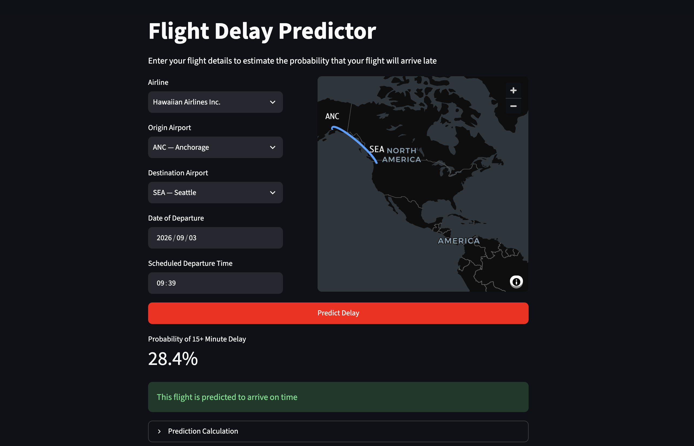
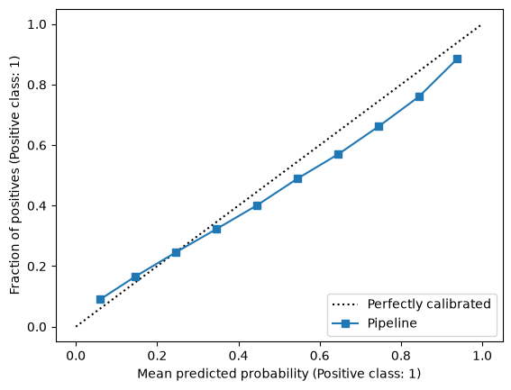

# Flight Delay Prediction

## Executive Summary

•	Developed an app for passengers to input their flight details and see the forecasted chance of a delay to assist with travel planning, particulary for connecting flights where on time arrival can be essential

•	Uses a machine learing model trained on historical US flight data enriched with historical weather forecast data 

•	When a user clicks predict the app will fetch the forecasted weather for the origin and arrival locations and incorporate the information into the prediction

## App Screenshot



## Repo Structure

```text
.
├── README.md
├── app.py
├── assets # used for README
│   ├── calibration-curve.png
│   └── example-image.png
├── data
│   ├── processed # contains output from src/data_pipeline.py
│   └── raw # raw flight and weather data
├── dockerfile
├── models 
│   └── xgboost_v1.joblib # main model used in app.py
├── notebooks # used for EDA and model training
│   ├── Enhance Airport Lookup table.ipynb
│   ├── Full Pipeline Test.ipynb
│   ├── Weather Experiments.ipynb
│   ├── Weather Models.ipynb
│   ├── full_EDA_preweather.ipynb
│   ├── initial_EDA.ipynb
│   └── model_exploration.ipynb
├── pyproject.toml
├── src
│   ├── data_pipeline.py
│   └── model_training.py
└── uv.lock
```

* Use the python scripts in `src` to replicate processed training data and final model
* Most raw data is not included due to file sizes
## Data Details

*	2025 data from the [US Bureau of Transportation Statistics]( https://transtats.bts.gov/DL_SelectFields.aspx?gnoyr_VQ=FGJ&QO_fu146_anzr=b0-gvzr)

*	Each row was one flight containing departure, arrival, distance, data and binary indicator of delayed more than 15 minutes on arrival

*	Weather forecast data from [Open-Meteo]( https://open-meteo.com). Merged into flight data in two ways.

    1.	Departure weather merged on the latitude and longitude of the departure airport at the hour of departure

    2.	Arrival weather merged on the latitude and longitude of the arrival airport at the hour of arrival

*	Weather data included temperature, precipitation, visibility, wind and surface pressure

* Full development process is available in `/notebooks` in the annotated notebooks

## Model Details

* Final model is an XGBoost model

* A wide range of other models, e.g. logistic regression, random forests, gradient boosted classifiers were tested but XGBoost slight outperformed them. 
    * See `notebooks/model_exploration` and `notebooks/Weather Models` for full details
    * All models were logged using MLFlow

* Hyperparameters were tuned using `RandomSearchCV` 

* Largest improvement in model performance came from adding weather data (F1 score increased from 0.24 to 0.33)

* Final performance was an accuracy of 79% and a F1 score of 0.33 on testing data. This is compared to a baseline of 77% accuracy and an F1 score of 0 using a dummy classifier predicting no delays. 

* Overall, flight delays are inherently difficult to predict a head of time especially excluding factors such as knock-on delays (which cannot be known a week in advance). It is therefore more informative to look at the predicted % chance of delay. 



* The graph above shows the model is fairly well calibrated. This means that, for example, if the model predicts a 30% of delay, around 30% of those flights will be delayed.

## App Details

* Created using Streamlit 

* Deployed on Streamlit Community Cloud

* Can also run locally by cloning the repo and running the following commands:

`docker build -t flight-delay .`

`docker run -p8501:8501 flight-delay`

